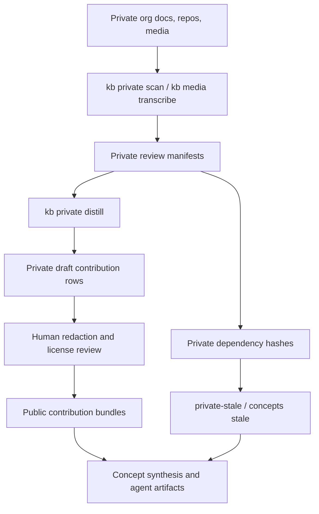

# Org Data Implementation Roadmap

## Goal

Use organization-specific Rock knowledge as a private input corpus while publishing only generalized, reviewed, source-linked guidance.

This roadmap covers:

- Private organization docs under `/path/to/private-rock-docs`.
- Other private Rock-related repos owned by Brian or ONE&ALL.
- Outside organization contribution bundles from churches, consultants, vendors, and Rock implementers.
- Private media transcripts that may contain operational knowledge.

The desired end state is a two-layer system:

- Private layer: raw docs, scans, transcripts, dependency hashes, local review queues, and source packs.
- Public layer: distilled concept guidance, task cards, troubleshooting trees, caveats, entity notes, examples, open questions, and source links.

Raw private text should never be required to use the public repo.

## Architecture



## Data Classes

| Class | Example | Storage | Public policy |
| --- | --- | --- | --- |
| Raw private source | Internal runbook, SQL, Lava, transcript, screenshot OCR | `data/review/`, `data/media/`, local source repo | Never public |
| Private scan record | File hash, path hash, risk flags, candidate concepts | `data/review/*.jsonl` | Never public |
| Private draft contribution | Distilled summary plus private source hashes | `data/review/private-distill/*.jsonl` | Never public until reviewed and stripped |
| Private dependency row | Contribution ID to private source hash map | `data/review/private-dependencies/*.jsonl` | Never public |
| Public contribution bundle | Reviewed JSONL from one org | `contributions/<org-key>/bundle.jsonl` | Public if audits pass |
| Public guide artifact | Concept guide, task card, entity note, caveat | `knowledge/concepts/**`, `agent/*.jsonl` | Public if source-linked and audit-passing |

## Owner Data Pipeline

Use this path for `/path/to/private-rock-docs` and other organization-owned private Rock material.

1. Scan the private source.

```bash
uv run kb private scan \
  --repo /path/to/private-rock-docs \
  --source-id rockproduction_docs_private_candidates \
  --org-id oneall
```

Use `--allowlist <file>` when a review pass should include only approved relative paths. The allowlist file is plain text, one relative path per line, with optional `#` comments.

Example:

```text
# private-scan-allowlist.txt
Operations/workflow-intake-patterns.md
Lava/shared-shortcode-notes.md
Reports/data-view-maintenance.md
```

Then run:

```bash
uv run kb private scan \
  --repo /path/to/private-rock-docs \
  --allowlist private-scan-allowlist.txt \
  --source-id rockproduction_docs_private_candidates \
  --org-id oneall
```

2. Review the output at `data/review/private-scan-docs.jsonl`.

Prioritize rows where:

- `review_classification` is `generalizable_pattern`,
- `public_contribution_mode` is `distill_then_review`,
- `risk_flags` is empty,
- `sensitive_findings` is empty,
- `candidate_concepts` includes a high-value concept.

3. Distill one concept at a time.

```bash
uv run kb private distill \
  --scan-path data/review/private-scan-docs.jsonl \
  --source-id rockproduction_docs_private_candidates \
  --concept workflows \
  --org-id oneall
```

4. Create a private promotion skeleton.

```bash
uv run kb contributions promote \
  --draft-path data/review/private-distill/rockproduction_docs_private_candidates-workflows.jsonl \
  --org-id oneall
```

This writes private staging rows under `data/review/contribution-promotion/`. They intentionally do not pass public contribution validation.

5. Human-review the draft rows under `data/review/private-distill/` and rewrite staged rows with public-safe language.

Before promotion, remove or rewrite:

- staff names, emails, phone numbers, and personal examples,
- internal URLs, instance hostnames, and route names that reveal private systems,
- Rock numeric IDs unless the ID is abstracted into a generic placeholder,
- ministry-specific operational details that are not useful outside the org,
- copied private prose.

6. Promote only newly written, reviewed rows into `contributions/oneall/bundle.jsonl`.

Promotion means:

- delete `private_source_hashes`,
- delete `private_path_hashes`,
- set `review_status` to `redaction_reviewed` or `approved_for_public_distillation`,
- set `redaction_attestation` and `license_attestation`,
- include source URLs or source record IDs when the idea is supported by public Rock docs, release notes, source code, or community pages,
- keep `needs_live_verification` true when behavior depends on local configuration.

Reviewed promotion requires a rewrite file keyed by private draft `contribution_id`:

```json
{"contribution_id":"private-distill:abc","public_contribution_id":"oneall:workflow-intake-review","title":"Workflow intake patterns need launch review","distilled_summary":"Newly written public-safe guidance with source support and no copied private text.","source_urls":["https://community.rockrms.com/documentation"],"source_record_ids":[],"confidence":"medium","needs_live_verification":true}
```

Then run:

```bash
uv run kb contributions promote \
  --draft-path data/review/private-distill/rockproduction_docs_private_candidates-workflows.jsonl \
  --org-id oneall \
  --rewrite-file data/review/rewrites/oneall-workflows.jsonl \
  --reviewed \
  --redaction-attestation \
  --license-attestation \
  --output contributions/oneall/bundle.jsonl
```

7. Validate and rebuild.

```bash
uv run kb contributions validate --path contributions/oneall/bundle.jsonl
uv run kb audit public-export
uv run kb audit licenses
uv run kb audit source-policy
uv run kb build --stage agent-pack
uv run kb build --stage index
```

## Outside Org Contribution Pipeline

Outside orgs should not send raw exports or private docs to this public repo. They should run the same review flow locally, then submit a public-safe bundle.

Recommended contributor workflow:

1. Fork or clone the repo.
2. Create a starter contribution folder.

```bash
uv run kb contributions new --org-id <org-key> --org-display-name "Example Church"
```

This writes `contributions/<org-key>/bundle.example.jsonl`. The example file is intentionally non-public and skipped by validation; copy only the relevant row shapes into `bundle.jsonl` after review.

3. Scan private docs locally.

```bash
uv run kb private scan \
  --repo <org-private-docs> \
  --source-id outside_org_contribution_candidates \
  --org-id <org-key>
```

4. Distill candidate rows by concept.

```bash
uv run kb private distill \
  --scan-path data/review/private-scan-<name>.jsonl \
  --source-id outside_org_contribution_candidates \
  --concept <concept-id> \
  --org-id <org-key>
```

5. Review the private draft rows locally.
6. Create `contributions/<org-key>/bundle.jsonl` from newly written public-safe rows.
7. Run the contributor-facing check and stricter validation.

```bash
uv run kb contributions check --path contributions/<org-key>
uv run kb contributions validate --path contributions/<org-key>/bundle.jsonl
uv run kb audit public-export
```

8. Submit a PR with only the reviewed public bundle and optional Markdown notes.

## Public Bundle Contract

Each row in `contributions/<org-key>/bundle.jsonl` must use:

```json
{
  "schema": "rock-kb-org-contribution-v1",
  "contribution_id": "org-key:short-stable-id",
  "org_id": "org-key",
  "org_display_name": "Example Church",
  "concept_ids": ["workflows"],
  "contribution_type": "troubleshooting_pattern",
  "title": "Workflow action retries should be designed for idempotency",
  "distilled_summary": "Write this as new public-safe guidance. Do not copy private docs. Describe the general Rock pattern, operational risk, and practical recommendation.",
  "source_urls": ["https://community.rockrms.com/documentation"],
  "source_record_ids": [],
  "redaction_attestation": true,
  "review_status": "redaction_reviewed",
  "license_attestation": true,
  "confidence": "medium",
  "needs_live_verification": true
}
```

Allowed `contribution_type` values:

- `task_card`
- `troubleshooting_pattern`
- `release_caveat`
- `entity_note`
- `guide_section`
- `source_link`
- `open_question`

Public bundles must not contain:

- `private_source_hashes`,
- `private_source_paths`,
- `private_path_hashes`,
- `raw_text`,
- `content`,
- `full_text`,
- `transcript`,
- internal URLs,
- staff or person data,
- secrets,
- copied private docs.

## Source Dependency And Rebuild Model

Private-derived public guidance needs a dependency model without exposing private material.

Use private dependency rows for local rebuild checks:

```bash
uv run kb private stale \
  --scan-path data/review/private-scan-docs.jsonl \
  --source-id rockproduction_docs_private_candidates \
  --concept workflows
```

Implementation target:

- `data/review/private-dependencies/*.jsonl` maps private draft IDs to private source hashes.
- Promoted public rows should carry a stable `contribution_id`.
- A private-only map under `data/review/private-promotion-dependencies/` connects promoted `contribution_id` values to private source hashes and public artifact paths.
- `kb private impact` compares that private-only map to the latest private scan and reports affected concepts and public artifacts.
- `kb status` reads that private-only map when present and marks affected concepts as needing rebuild.
- Public export should never include the private dependency map.

## Media And Transcript Inputs

Podcast, RockU, webinar, and community hub media should be private corpus first.

Workflow:

```bash
uv run kb media discover --source rock_podcast_rss
uv run kb media discover --source rock_rocku --include-empty
uv run kb media discover --source rock_community_hubs --include-empty
uv run kb media doctor
uv run --extra media kb media transcribe --source rock_podcast_rss --tool mlx_whisper --model auto
uv run kb media normalize --source rock_podcast_rss
```

Transcript policy:

- raw transcripts stay private,
- transcript hashes may be used for rebuild detection,
- normalized media insight rows may feed guide synthesis,
- public artifacts cite the media URL and summarize newly written insights.

## Implementation Backlog

### Phase 1 - Harden Intake

- Implemented: `bundle.example.jsonl` files are non-validated starter templates.
- Implemented: `kb contributions new --org-id <id>` creates a starter folder and template.
- Implemented: `kb private review-report` summarizes scan rows by classification, concept, and risk flag without exposing private paths or content.
- Implemented: allowlist support documentation for private scans.
- Implemented: tests cover private scan review reporting, non-validated contribution templates, and private dependency export boundaries.

### Phase 2 - Promotion Workflow

- Implemented: `kb contributions promote` transforms selected private draft rows into a private staging skeleton by default.
- Implemented: reviewed public promotion requires a reviewer-supplied rewrite file before `redaction_attestation` and `license_attestation` can be set.
- Implemented: duplicate detection by `contribution_id`, source URL, and normalized title.
- Implemented: optional `reviewer_notes` field is allowed publicly and passes the same privacy checks.

### Phase 3 - Private Staleness Integration

- Implemented: reviewed promotion writes private dependency rows with `public_artifact_path`.
- Implemented: `kb status` includes private dependency hash changes when local private maps and scan manifests exist.
- Implemented: `kb private impact --scan-path <path> --source-id <id>` shows which concepts and public artifacts depend on changed private hashes.

### Phase 4 - Synthesis Integration

- Implemented: `kb concepts synthesize` and `kb concepts hydrate` include approved public contribution bundles as org-contribution sources by default.
- Implemented: private draft rows are available only through explicit `--include-private-drafts --private-draft-path <path>` flags on hydrated packs.
- Implemented: synthesis prompts require private-influenced guidance to be rewritten, public-source-supported, and live-verification-aware.
- Implemented: guide-quality checks cover contribution traceability, official-versus-org/community labeling, and live-verification language when contribution records require it.

### Phase 5 - Contributor Experience

- Implemented: `contributions/example-org/bundle.example.jsonl` includes examples for each contribution type.
- Implemented: one-command contributor audit via `uv run kb contributions check --path contributions/<org-key>`.
- Implemented: PR checklist text for redaction, license attestation, and source links.
- Implemented: anonymous org guidance with stable `org_id` and `org_display_name`.

## Agent Operating Rules

Agents implementing this system should:

- treat private scan outputs as private working data,
- write new public guidance from source understanding instead of copying private text,
- prefer public Rock docs/source/release notes for authoritative claims,
- label community and org-derived examples as examples,
- keep dependency hashes private,
- run contribution and public export audits before claiming anything is publishable,
- update this roadmap when adding commands or changing the contract.
